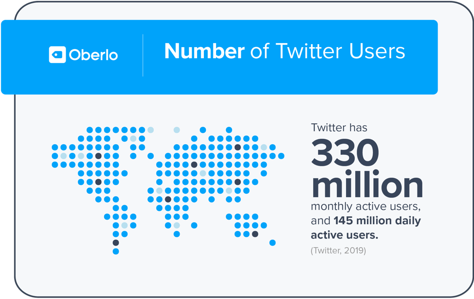

# Sentweetment Analysizer

  

  

## Table of Contents

* [What are you trying to do?](#what-are-you-trying-to-do)
* [How has this problem been solved before?](#how-has-this-problem-been-solved-before)
* [What is new about your approach?](#what-is-new-about-your-approach,-why-do-you-think-it-will-be-successful)
* [Who cares?](#who-cares-if-you're-successful,-what-will-the-impact-be)
* [How will you present your work?](#how-will-you-present-your-work)
* [What are your data sources?](#what-are-your-data-sources?-what-is-the-size-of-your-dataset,-and-what-is-your-storage-format)
* [What are potential problems with your capstone?](#what-are-potential-problems-with-your-capstone)
* [What is the next thing you need to work on?](#what-is-the-next-thing-you-need-to-work-on)

### What are you trying to do?

  

  

### How has this problem been solved before?

### What is new about your approach, why do you think it will be successful?

### Who cares? If you're successful, what will the impact be?

### How will you present your work?
The work will be presented through an interactive flask app.  A user will be able to gain insight on the three North American Heads of State.  The goal is to have a pipeline set up that any user can search their own tweeter account and get a personal sentiment analysis of their own tweeter feed as well.  

### What are your data sources? What is the size of your dataset, and what is your storage format?
Twitter will be the sole source of my data.  The size of my dataset will vary; however, the goal is to have at least 100, 000 tweets, from various politicians.  The storage format will be through a mongodb database.  I will utilize several python packages to scrape data from Tweeter, along with using their API.  

### What are potential problems with your capstone?

### What is the next thing you need to work on?
