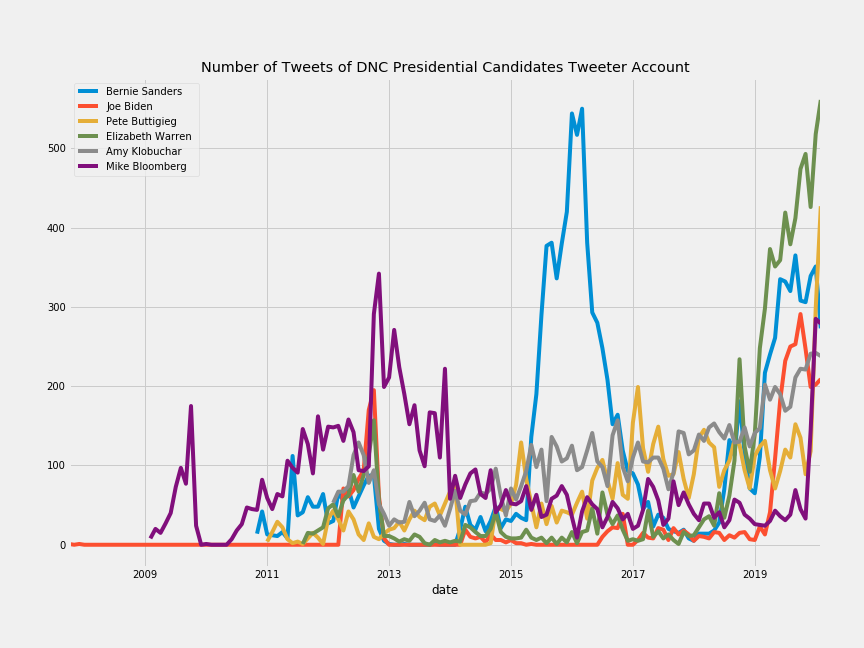

# Sentweetment Analysizer
<p align="center">
  
</p>  

## Table of Contents

* [General Information](#general-information)
    * [Data Gathering](#data-gathering)
* [Technologies](#technologies)
    * [Database](#database)
    * [Python](#python)
    * [Visualization](#visualization)
* [Future Improvements](#future-improvements)

## General Information
<p align="center">
  
</p>  

Over the years Twitter has continued to become a stronger social media platform with over 338 monthly active users.  Being a microblogging platform, it has allowed for people to interact with each other by expressing themselves through a tweet, which others can reply or show support through retweeting a comment or ‘liking’ it by clicking favorites.  This platform has become quite important to many politicians as a way to express their positions and interact with electorate.  My objective with this project was to analyze the candidate’s tweets through NLP analysis, all to gauge the polarity of their message and find features that could be indicative of the potential likability of their words in future tweets.

### Data Gathering:
<p align="center">
  
</p>

Data used for this analysis was gathered from Zillow, Realtor, and Realty Austin websites.  The data gathering techniques where separated into three phases, which are located under the ```src``` folder.  Two ```csv``` files, the results of the webscraping, are stored in the ```data``` directory.

1)   Scraping:  Three scrappers were used to gather current listing information from each site, code can be found under ```scrapper``` folder.  
2)  Transform:  It was transformed into a clean pandas dataframe through custom functions, located on the ```data_transformer``` folder.
3)  Cleansing:  Functions on the ```data_cleansing``` folder utilized the transform functions to clean the data and store clean data back to mongodb.   

###### Conclusion


### Sample Information:
Detailed Information on the analysis process is on ```dnc_race.ipynb``` file, under the ```notebooks``` folder.  Data gathered for this analysis was collected using twitters API along with python library called ```GetOldTweets```.  The information was from DNC Candidates twitter feeds from the beginning of their twitter accounts to February 24th.  Analysis was conducted from the candidates announcement to February 24th.  
<p align="center">
  
</p>

## Technologies
<p align="center">
  
</p>

###### Database:
Data Storage: Mongodb<br>

###### Python:
Data Gathering: Beautiful Soup, API, Selenium<br>
Data Analysis: Python 3, Numpy, Pandas, Scikit-Learn, Scipy, HTML, CSS, Flask<br>

###### Visualization:
Data Visualization: Plotly, Matplotlib, Seaborn

## Future Improvements
• Use another sentiment library (Spacy, Vador).<br>
• Enrich data-set with debate, interview, and major tv apperance dates<br>
• Use different model, like Random Forest Classifier<br>